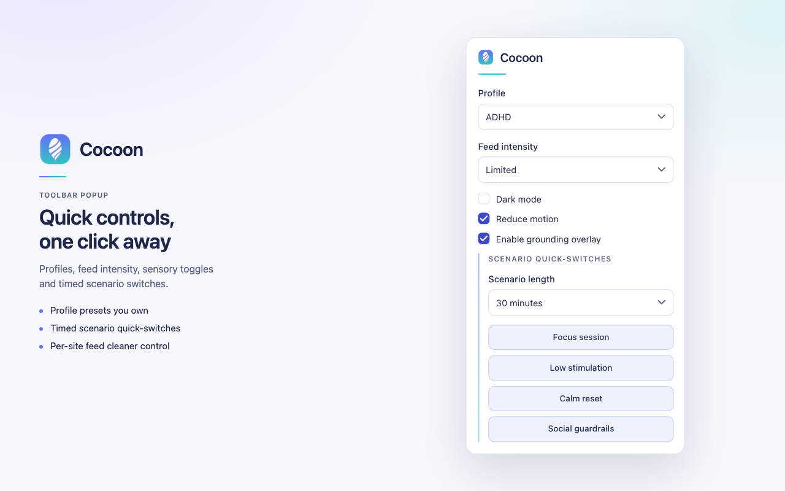

# Cocoon

Chrome extension that hides algorithmic feeds and lowers sensory load on the
sites that need it most. Not yet on the Chrome Web Store — load it unpacked
(below).

It covers 7 hostnames across 6 sites: x.com / twitter.com, facebook.com,
instagram.com, youtube.com, reddit.com and tiktok.com. Instagram and Facebook
got their rules from [feedless](https://github.com/gr8monk3ys/feedless), a
Meta-only extension that was merged into this one and archived: at the
strongest setting they now also hide Reels, Stories, Explore/Watch and the
suggestion rails, and Facebook's feed is found by its screen-reader heading
because Facebook dropped `role="feed"` in 2026. Everything runs on the device:
no accounts, no analytics, no network requests, host permissions limited to
those 7 hostnames.

<p align="center">
  
</p>

## What it does

- **Feed cleaner** with three intensities: `full` (off), `limited` (the feed
  itself), `none` (feed plus Reels/Stories/Explore-style surfaces). Per-site
  overrides. A banner tells you if a site's layout changed and nothing matched.
- **Profiles**: ADHD, Autism, Anxiety and Custom presets
  (`docs/PROFILE_RATIONALE.md` explains each).
- **Sensory controls**: colour-inversion dark mode and reduced motion.
- **Grounding overlay**: a motion-free breathing timer plus a 5-4-3-2-1 flow.
- **Scenarios**: Focus / Low stimulation / Calm reset / Social guardrails on a
  15/30/60-minute timer that restores your baseline when it ends.

## Design: rules → CSS, fixture-tested

`src/rules/<host>.ts` is the single source of truth. Each host lists rules
with a selector (or a text-anchored marker for surfaces CSS cannot tell
apart), the gentlest intensity that enables it, and optionally the page kinds
it applies to:

```ts
{ id: "instagram.feedPosts", intensity: "limited", selector: "main article", paths: ["home"] }
```

From that list the content script generates the stylesheet it injects
(`src/lib/feedRules.ts`), gated on a `data-cocoon-path` attribute it stamps on
`<html>` and re-stamps as the SPA navigates, so an opened Instagram post is
never hidden by the home-feed rule. The same list drives the selector-rot
check (rules flagged `mayBeAbsent` are excused), the manifest host-permission
consistency test, and the e2e suite: `e2e/fixtures/<host>.html` mirrors each
site's live markup, and `npm run e2e` checks every rule matches its fixture,
the generated CSS parses in Chromium with zero dropped rules, and then loads
the **built** extension into Chromium with each fixture served at the real
host URL and asserts the feed is actually hidden. Fixtures are hand-written
snapshots, so they catch bad rule edits; live drift is what the in-page banner
is for.

## Install (unpacked)

```bash
npm install && npm run build
```

Open `chrome://extensions`, enable **Developer mode**, **Load unpacked**,
pick `dist/`.

## Develop

```bash
npm run check   # lint, unit tests, typecheck + build, e2e, prod-dep audit
npm test        # vitest only
npm run e2e     # playwright: fixtures + built extension (needs `npm run build`)
npm run package:extension   # zip dist/ for the store
```

CI (`.github/workflows/ci.yml`) runs the same steps on every PR; CodeQL runs
on push and monthly. Privacy policy and support pages are published from
`docs/` to <https://cocoon.lscaturchio.xyz/privacy/> and
<https://cocoon.lscaturchio.xyz/support/>; `docs/STORE_LISTING.md` is the
store submission kit.

## Layout

- `public/manifest.json` — MV3 manifest; hosts must match `src/rules`
- `src/rules/` — per-host feed rules (the thing to edit when a site changes)
- `src/lib/feedRules.ts` — rule → CSS generator, path classifier, rot detection
- `src/lib/marker.ts` — MutationObserver that stamps text-identified units
- `src/content.ts` — injects CSS, stamps the path, banner, grounding dialog
- `src/popup/`, `src/options/` — React UIs; `src/lib/settings.ts` — typed settings
- `e2e/` — fixtures and Playwright specs

## License

MIT
